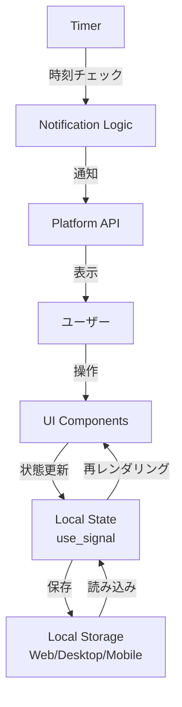
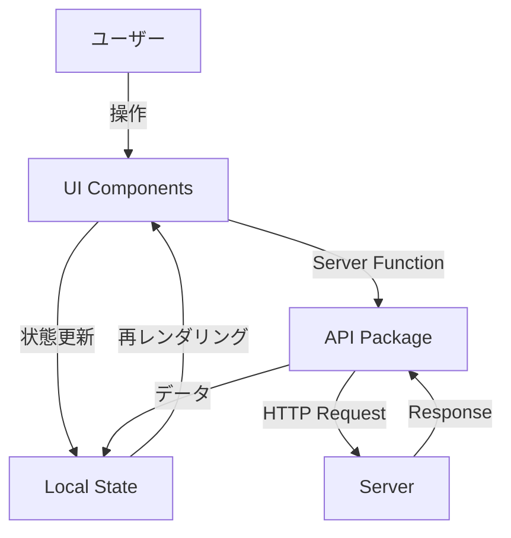

# アーキテクチャドキュメント

## 概要

hayonerobotは、Dioxus 0.7を使用したマルチプラットフォーム対応の就寝時刻管理アプリケーションです。Web、Desktop(Windows)、Mobile(Android)の3つのプラットフォームで動作し、それぞれが独立したスタンドアロンアプリケーションとして機能します。

## プロジェクト構成

```
hayonerobot/
├── Cargo.toml              # ワークスペース設定
├── README.md               # プロジェクト概要(ユーザー向け + 開発者向け)
├── AGENTS.md               # Dioxus 0.7のLLM向けリファレンス
├── CONTRIBUTING.md         # 開発ガイドライン
├── docs/
│   ├── architecture.md     # このファイル
│   └── bot-specifications.md  # ボットの振る舞い仕様
└── packages/
    ├── web/                # Webアプリケーション
    ├── desktop/            # Desktopアプリケーション
    ├── mobile/             # Mobileアプリケーション
    ├── ui/                 # 共有UIコンポーネント
    └── api/                # 将来のサーバー機能用(現在未使用)
```

## アーキテクチャの原則

### 1. スタンドアロンバンドル方式

各プラットフォームは完全に独立したアプリケーションとして動作します:

- ✅ **サーバー不要**: すべてのロジックはクライアント側で実行
- ✅ **独立ビルド**: 各プラットフォームを個別にビルド・実行可能
- ✅ **共有コンポーネント**: `ui` crateを通じてUIを再利用
- ✅ **プラットフォーム固有のカスタマイズ**: 各プラットフォームが独自のルートとビューを持てる

### 2. ワークスペース構成

Cargoワークスペースを使用して、複数のcrateを一元管理:

```toml
[workspace]
members = [
    "packages/ui",
    "packages/web",
    "packages/desktop",
    "packages/mobile",
    "packages/api",
]

[workspace.dependencies]
dioxus = { version = "0.7.1" }
```

## パッケージ詳細

### `packages/ui` - 共有UIコンポーネント

すべてのプラットフォームで使用される共通のUIコンポーネントを提供します。

**現在のコンポーネント:**
- `Hero`: ヒーローセクション
- `Navbar`: ナビゲーションバー
- `Echo`: エコー機能(クライアントサイドのみ)

**今後追加予定:**
- `BotAvatar`: ボットのアバター表示
- `NotificationCard`: 通知カード
- `SettingsPanel`: 設定パネル
- `TimeSelector`: 時刻選択UI

### `packages/web` - Webアプリケーション

ブラウザで動作するWebアプリケーション。

**特徴:**
- PWA対応(予定)
- Web Notifications API使用
- ローカルストレージでの設定保存

**エントリーポイント:** `packages/web/src/main.rs`

### `packages/desktop` - Desktopアプリケーション

Windowsネイティブアプリケーション。

**特徴:**
- システムトレイ常駐(予定)
- Windowsネイティブ通知
- 自動起動設定(予定)

**エントリーポイント:** `packages/desktop/src/main.rs`

### `packages/mobile` - Mobileアプリケーション

Android向けモバイルアプリケーション。

**特徴:**
- プッシュ通知
- バイブレーション機能
- バックグラウンド動作(予定)

**エントリーポイント:** `packages/mobile/src/main.rs`

### `packages/api` - API層(将来用)

現在は未使用。将来的にサーバー機能が必要になった場合に使用します。

**想定される用途:**
- ユーザーデータの同期
- 統計情報の集約
- クラウド設定の保存

## データフロー

### 現在のアーキテクチャ(クライアントサイドのみ)



### 将来のアーキテクチャ(サーバー機能追加後)



## 状態管理

### ローカル状態

各コンポーネントは `use_signal` を使用してローカル状態を管理:

```rust
#[component]
fn Settings() -> Element {
    let mut bedtime = use_signal(|| "23:00".to_string());
    let mut bot_type = use_signal(|| BotType::Robot);
    
    // ...
}
```

### グローバル状態(Context API)

アプリ全体で共有する設定は Context API を使用:

```rust
#[component]
fn App() -> Element {
    let mut app_settings = use_signal(|| AppSettings::default());
    use_context_provider(|| app_settings);
    
    rsx! { Router::<Route> {} }
}
```

### 永続化

各プラットフォームのストレージAPIを使用:

- **Web**: `localStorage` / `IndexedDB`
- **Desktop**: ファイルシステム(`AppData`フォルダ)
- **Mobile**: Android Shared Preferences

## 通知システム

### プラットフォーム別実装

#### Web
```rust
// Web Notifications API使用
#[cfg(target_family = "wasm")]
fn send_notification(message: &str) {
    // Notification API呼び出し
}
```

#### Desktop
```rust
// Windows Toast Notifications使用
#[cfg(target_os = "windows")]
fn send_notification(message: &str) {
    // Windows API呼び出し
}
```

#### Mobile
```rust
// Android Notifications使用
#[cfg(target_os = "android")]
fn send_notification(message: &str, vibrate: bool) {
    // Android API呼び出し
}
```

## ルーティング

各プラットフォームは独自のルート定義を持ちます:

```rust
#[derive(Debug, Clone, Routable, PartialEq)]
enum Route {
    #[layout(NavBar)]
    #[route("/")]
    Home {},
    #[route("/settings")]
    Settings {},
    #[route("/history")]
    History {},
}
```

## ビルドとデプロイ

### 開発環境

```bash
# Web
dx serve --package web --platform web

# Desktop
dx serve --package desktop --platform desktop

# Mobile
dx serve --package mobile --platform android
```

### プロダクションビルド

```bash
# Web
dx build --package web --platform web --release

# Desktop
dx build --package desktop --platform desktop --release

# Mobile
dx build --package mobile --platform android --release
```

## セキュリティ考慮事項

### データプライバシー

- すべてのデータはローカルに保存
- 外部サーバーへのデータ送信なし(現時点)
- ユーザーの就寝時間などの個人情報は端末内のみで管理

### 権限

#### Web
- 通知権限
- ローカルストレージアクセス

#### Desktop
- ファイルシステムアクセス(設定保存用)
- 通知権限

#### Mobile
- 通知権限
- バイブレーション権限
- バックグラウンド実行権限(予定)

## パフォーマンス最適化

### レンダリング最適化

- 不要な再レンダリングを避けるため、`use_memo` を活用
- 大きなリストには仮想スクロール(必要に応じて)

### バンドルサイズ最適化

- 未使用のコードは自動的に削除(tree-shaking)
- リリースビルドでは最適化レベル `opt-level = "z"` を使用(予定)

## テスト戦略

### ユニットテスト

```rust
#[cfg(test)]
mod tests {
    use super::*;
    
    #[test]
    fn test_bot_message_generation() {
        // テストコード
    }
}
```

### 統合テスト

- 各プラットフォームでの動作確認
- 通知機能のテスト
- 設定の永続化テスト

## 今後の拡張計画

### Phase 1: 基本機能(現在)
- [x] プロジェクト構造の確立
- [ ] 基本的な通知機能
- [ ] 設定画面
- [ ] ボット機能(ボット、おかん)

### Phase 2: 機能拡張
- [ ] 統計情報の表示
- [ ] カスタム通知音
- [ ] 複数の就寝時刻設定
- [ ] ボットの種類追加

### Phase 3: サーバー統合
- [ ] ユーザーアカウント
- [ ] クラウド同期
- [ ] データ分析

## 参考資料

- [Dioxus 0.7 Documentation](https://dioxuslabs.com/learn/0.7)
- [AGENTS.md](../AGENTS.md) - Dioxus 0.7のLLM向けリファレンス
- [bot-specifications.md](./bot-specifications.md) - ボットの振る舞い仕様
